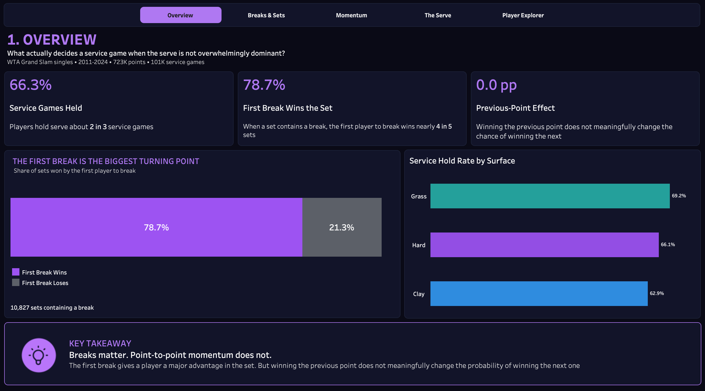
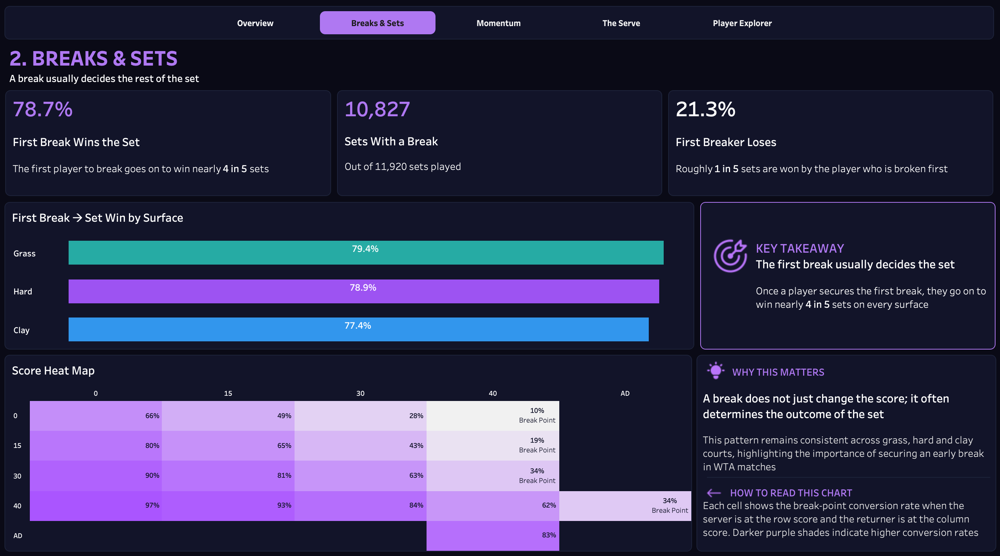
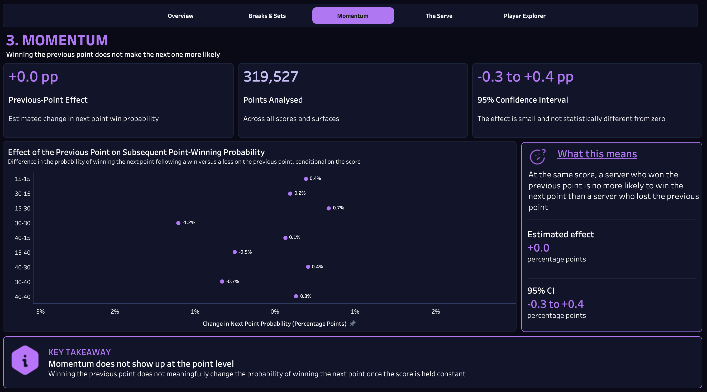
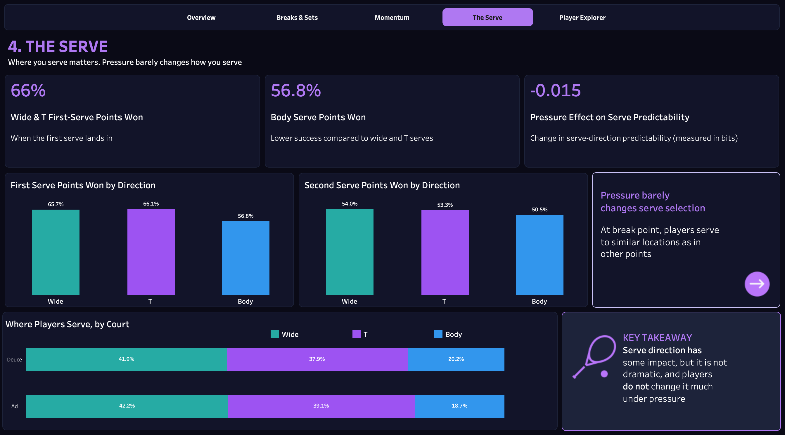
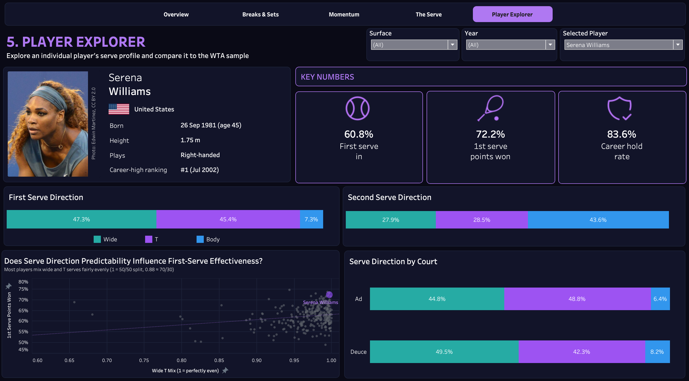

# The Break Point Problem: Serve, Pressure and Predictability on the WTA Tour

**On the women's tour, where the serve is less dominant than on the men's tour, what actually decides service games?**

This project analyses **723,000 points from women's Grand Slam singles (2011–2024)** and **811,000 shot-charted serves** to investigate whether breaks of serve matter, whether momentum exists, and what separates players who hold serve from those who get broken.

**[View the interactive dashboard on Tableau Public](https://public.tableau.com/views/break_point_problem/Overview?:language=en-US&:sid=&:redirect=auth&:display_count=n&:origin=viz_share_link)**

## Key findings

### Breaks decide sets, but momentum is hard to find

1. **Women hold serve about two-thirds of the time at the Slams (66%).** Hold rate is 63% on clay, 66% on hard courts and 69% on grass, across 101,263 service games.
2. **The first player to break wins nearly four in five sets (79%).** The pattern holds across surfaces, based on 10,827 completed sets containing a break.
3. **There is little evidence of a meaningful letdown after breaking.** Players are broken straight back 31% of the time. Compared with their career rate, that looks like a 3.3-percentage-point dip, but much of it reflects how well the player is performing that day. Compared with the rest of the same match, the difference is much smaller: −0.6 percentage points (95% CI: −1.0 to −0.1).
4. **Momentum does not show up point to point.** At the same score (for example, 30–30), a server who won the previous point is no more likely to win the next point than a server who lost it: +0.0 percentage points (95% CI: −0.3 to +0.4), across 319,527 points.

### Serve direction matters more than pressure

5. **The body serve is the weak spot.** First serves that land in win 66% of points when aimed wide or down the T, compared with 57% when aimed at the body.
6. **A more balanced wide/T mix is associated with better serve outcomes.** Players who mix wide and T serves more evenly win more points on serve (Spearman *r* = +0.21) and hold serve more often (*r* = +0.19; 185 players). A simple overall-predictability measure can be misleading because it is strongly affected by how rarely a player serves to the body.
7. **Pressure barely changes serve selection.** On break points, serve direction becomes very slightly more predictable (−0.015 bits on a 0–1.58 scale). The difference is detectable across 41,602 break-point serves, but small in practice, and appears in only about half of player-and-court combinations.

These are associations, not proof of cause and effect. Stronger servers may both avoid the body and vary their wide/T serves more because they are stronger servers overall.

## The dashboard

The interactive Tableau dashboard has five pages:

| Page | What it shows |
|---|---|
| **1. Overview** | Hold rate, the value of the first break, momentum at a glance, and hold rate by surface |
| **2. Breaks & Sets** | How often the first break decides a set, how the pattern varies by surface, and hold probabilities across game-score states |
| **3. Momentum** | The previous-point effect at each score, with its confidence interval |
| **4. The Serve** | Points won by serve direction, where players serve on each court, and the break-point pressure analysis |
| **5. Player Explorer** | Explore a charted player's profile, serve-direction patterns, year/surface splits, and position relative to other players |

| Breaks & Sets | Momentum | The Serve | Player Explorer |
|---|---|---|---|
|  |  |  |  |

## Method

| Question | Data | Approach |
|---|---|---|
| Hold rates | Grand Slam point-by-point data | Share of non-tiebreak service games held, with 95% Wilson confidence intervals |
| Break-back | Grand Slam point-by-point data | After a break, compare the breaker's next service game with her career break rate and with her performance in the same match |
| Break value | Grand Slam point-by-point data | Among completed sets containing a break, calculate how often the first player to break wins the set |
| Momentum | Grand Slam point-by-point data | Compare servers at the same score who arrived there by winning versus losing the previous point. The 95% confidence interval

## AI Usage

AI tools were used to support the development of this project through:

- Debugging Python code and troubleshooting technical issues
- Exploring statistical methods and analytical approaches
- Improving project documentation and organisation

The data processing, statistical analysis, modelling, visualisation and final project decisions were carried out and reviewed by me.